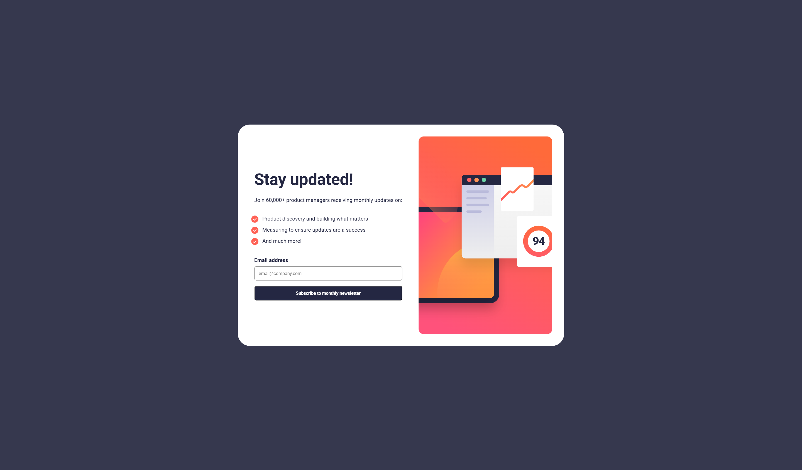
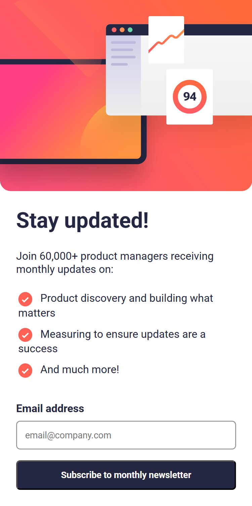
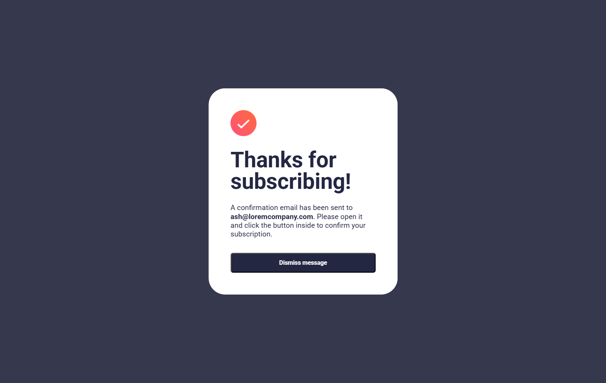
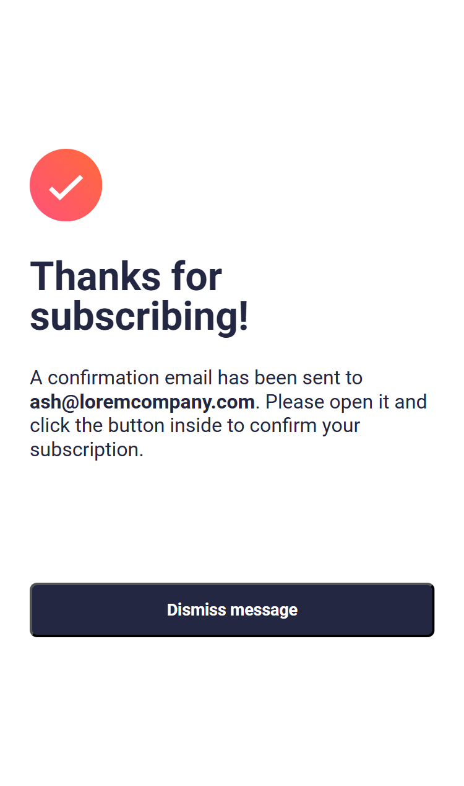
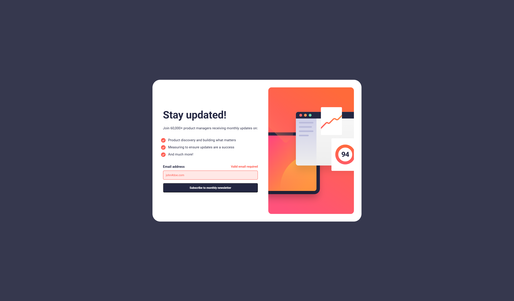

# Frontend Mentor - Newsletter sign-up form with success message solution

This is a solution to the [Newsletter sign-up form with success message challenge on Frontend Mentor](https://www.frontendmentor.io/challenges/newsletter-signup-form-with-success-message-3FC1AZbNrv). Frontend Mentor challenges help you improve your coding skills by building realistic projects.

## Table of contents

- [Overview](#overview)
  - [The challenge](#the-challenge)
  - [Screenshot](#screenshot)
  - [Links](#links)
- [My process](#my-process)
  - [Built with](#built-with)
  - [What I learned](#what-i-learned)
  - [Continued development](#continued-development)
  - [Useful resources](#useful-resources)

## Overview

# Project Overview

This project is a newsletter sign up with success message card built as part of a Frontend Mentor challenge. It provides an email input if the given email address is valid, it takes the user to the success message page. The newsletter sign up follows best practices for security and performance, making it suitable for production environments.

### The challenge

Users should be able to:

- Add their email and submit the form
- See a success message with their email after successfully submitting the form
- See form validation messages if:
  - The field is left empty
  - The email address is not formatted correctly
- View the optimal layout for the interface depending on their device's screen size
- See hover and focus states for all interactive elements on the page

### Screenshot







### Links

- Solution URL: [Add solution URL here](https://github.com/remainhumble/Newsletter-sign-up-form-with-success-message)
- Live Site URL: [Add live site URL here](https://remainhumble.github.io/Newsletter-sign-up-form-with-success-message/)


### My Process

1. **Project Setup**: Initialized the project using Visual Studio Code's Source Control and set up the folder structure for designs and assets.
2. **Component Development**: Built reusable components for the form, input fields, and success message card.
3. **Form Validation**: Implemented client-side validation for email input using regular expressions and provided real-time feedback.
4. **Responsive Design**: Used Flexbox to ensure the layout adapts smoothly to different screen sizes.
5. **Styling**: Applied custom CSS properties and styled-components for modular and maintainable styles.
6. **Testing**: Manually tested the form on various devices and browsers to ensure consistent behavior and appearance.
7. **Deployment**: Deployed the finished project to GitHub Pages for live access.

### Built with

- Semantic HTML5 markup
- CSS custom properties
- Flexbox
- Mobile-first workflow

### What I learned

During this project, I deepened my understanding of form validation in JavaScript, especially using regular expressions to check for valid email formats. I also learned how to provide real-time feedback to users by updating the UI based on validation results. Implementing responsive layouts with Flexbox helped me appreciate the importance of mobile-first design. Additionally, I became more comfortable with deploying static sites using GitHub Pages.

To see how you can add code snippets, see below:

```html
<!-- type is set to text for custom validation -->
   <input
            type="text"
            id="email"
            name="email"
            placeholder="email@company.com"
          />
```

```js
const emailRegex = /^[^\s@]+@[^\s@]+\.[^\s@]+$/;

```


### Continued development

In future projects, I want to continue focusing on:

- Improving accessibility by ensuring all interactive elements are keyboard navigable and screen reader friendly.
- Deepening my understanding of advanced form validation techniques, including asynchronous validation and accessibility considerations.
- Refining my CSS skills, particularly with CSS Grid and advanced Flexbox layouts for more complex responsive designs.
- Exploring state management solutions for larger projects to handle form state and UI feedback more efficiently.
- Enhancing automated testing practices to cover more edge cases and ensure robust user experiences.
- Optimizing performance for faster load times and better user engagement, especially on mobile devices.
- Experimenting with component libraries or frameworks to speed up development and maintain consistency across projects.
- Continuing to learn about web accessibility standards (WCAG) and how to implement them effectively.

### Useful resources

- [JavaScript Form Validation - Web Dev Simplified](https://youtu.be/In0nB0ABaUk?si=nuFpqXomkFEc8yBS) - Kyle covers all of the concepts of form validation in JavaScript as well as how to display helpful error messages to the user. 
- [Learn RegEx By Building A Spam Filter](https://www.freecodecamp.org/learn/javascript-algorithms-and-data-structures-v8/learn-regular-expressions-by-building-a-spam-filter/) -  Learn how to construct regex patterns, use regex methods, and apply these skills to solve real-world problems like form validation.


## Author

- Frontend Mentor - [@remainhumble](https://www.frontendmentor.io/profile/remainhumble)
- X(formerly Twitter) - [@thiflan120699](https://x.com/thiflan120699)

